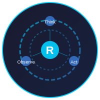

<p align="center">
  
</p>

<h1 align="center">fyuo_bot</h1>

<p align="center">
  <b>基于 ReAct 循环的 AI Agent 框架</b> — 思考、行动、观察、自省，让 LLM 真正"用起来"
</p>

<p align="center">此页面由fyuo_bot自行构建</p>

<p align="center">
  
  
  
  
  
</p>

<p align="center">
  <a href="#核心特性">核心特性</a> •
  <a href="#快速开始">快速开始</a> •
  <a href="#项目架构">项目架构</a> •
  <a href="#贡献指南">贡献指南</a> •
  <a href="#许可证">许可证</a>
</p>

<p align="center">
  <a href="https://github.com/fyuo863/fyuo_bot"><b>GitHub 仓库</b></a> •
  <a href="https://github.com/fyuo863"><b>作者主页</b></a>
</p>

---

## 项目简介

**fyuo_bot** 是一个轻量级、可扩展的 AI Agent 框架，基于经典的 **ReAct（Reasoning + Acting）** 范式构建。它的设计理念是：让语言模型不仅能"思考"，还能"动手"——调用工具、操作文件、查询信息，并在每次回答后自我审查。

> 简单来说：你给它一个目标，它自己规划、执行、检查，直到完成。

---

## 核心特性

| 特性 | 说明 |
|---|---|
| ReAct 循环 | 思考-行动-观察闭环，最多 20 轮防死循环 |
| 多轮自评 | 每次回答后自动审视，发现不足主动修正，最多 3 轮 |
| 子 Agent 嵌套 | 整个 Agent 可封装为工具，支持 3 层嵌套调用 |
| 双轨记忆 | LLM 驱动的持久记忆（习惯/信息）+ SQLite 对话历史 |
| 丰富内置工具 | 文件操作、命令执行、天气查询、定位、提问等 |
| 对话自动浓缩 | 每轮对话由 LLM 自动分类、摘要，支持按话题检索 |

### 技术栈

```
Runtime:  Python 3.10+  |  openai  |  tiktoken
Storage:  SQLite (历史)  |  文件系统 (持久记忆)
Design:   ReAct范式  |  工具编排  |  递归嵌套  |  自省机制
```

---

## 快速开始

### 安装

```bash
# 克隆仓库
git clone https://github.com/fyuo863/fyuo_bot.git
cd fyuo_bot

# 安装依赖
pip install openai tiktoken

# 配置环境变量
export OPENAI_API_KEY="your-api-key"
export OPENAI_BASE_URL="https://api.openai.com/v1"
export OPENAI_MODEL_NAME="gpt-4o-mini"
```

### 运行

```bash
python src/fyuo_bot/main.py
```

然后直接输入你的需求，Agent 会自主规划并执行。

---

## 项目架构

```
src/fyuo_bot/
├── core/               # 核心引擎
│   ├── agent.py        # ReActAgent —— 思考-行动循环，自评机制
│   ├── chat.py         # AgentChat —— OpenAI 流式对话 + tool calling 解析
│   └── usage.py        # Usage —— 流式碎片拼装为 assistant 消息
├── tools/              # 工具系统
│   ├── base.py         # BaseTool 基类 + 内置工具（文件、命令、天气等）
│   ├── agent_tool.py   # AgentTool —— 将整个 Agent 封装为可嵌套调用的工具
│   └── memory_tools.py # replace_memory / get_history 工具
├── memory/             # 存储系统
│   ├── manager.py      # MemoryManager —— MEMORY.md / USER.md 持久记忆
│   └── history.py      # HistoryManager —— SQLite 对话历史，LLM 自动浓缩分类
├── config/
│   └── config.py       # API 密钥、模型注册表
└── main.py             # CLI 入口
```

---

## 双轨存储详解

| 存储 | 位置 | 内容 | 管理方式 |
|---|---|---|---|
| 持久记忆 | `MEMORY.md` / `USER.md` | 操作习惯、个人信息 | Agent 调用 `replace_memory` |
| 对话历史 | SQLite `history.db` | 浓缩对话 + 话题分类 | 每轮自动 `save_turn`，`get_history` 搜索 |

对话历史存入前经 LLM 判断：寒暄/闲聊自动跳过，有实质内容则按话题分类（如 "Python编程"、"Bug修复"）并浓缩为 1-3 句摘要。

---

## 内置工具一览

| 工具 | 用途 |
|---|---|
| `new_file` | 创建文件或文件夹，自检确认 |
| `write_file` | Python 原生文件流写入，写后读回校验 |
| `read_file` | 读取工作区内文件 |
| `list_files` | 列出目录结构 |
| `do_command` | 执行 shell 命令（需用户审批） |
| `get_weather` | 查询天气 |
| `get_location` | IP 定位 |
| `let_user_answer` | 向用户提问 |
| `run_agent` | 启动子 Agent |
| `get_model_list` | 查看可用模型 |
| `replace_memory` | 管理持久记忆 |
| `get_history` | 搜索对话历史 |

---

## 贡献指南

欢迎任何形式的贡献！无论是 Bug 报告、功能建议还是代码提交。

1. Fork 本仓库
2. 创建你的特性分支 (`git checkout -b feature/amazing-feature`)
3. 提交你的改动 (`git commit -m 'Add amazing feature'`)
4. 推送到分支 (`git push origin feature/amazing-feature`)
5. 发起 Pull Request

请在提交前确保你的代码风格一致，核心逻辑有必要的注释。

---

## 路线图

- [ ] 异步工具执行
- [ ] 对话历史向量搜索
- [ ] 更完善的安全沙箱
- [ ] 外部工具插件系统
- [ ] Web UI 界面

---

## 许可证

本项目采用 [MIT License](LICENSE) 开源。

---

<p align="center">
  <sub>Built with ❤️ and a lot of LLM tokens</sub>
</p>

<p align="center">
  <a href="https://github.com/fyuo863"></a>
</p>
